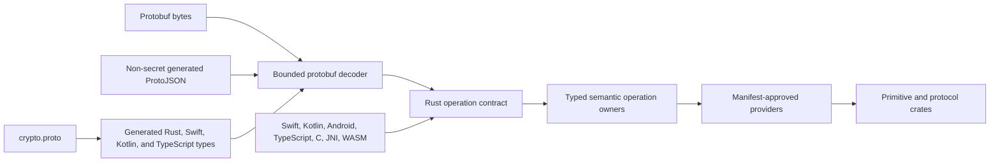

<!--
SPDX-FileCopyrightText: Copyright © 2026 ReallyMe LLC. All rights reserved

SPDX-License-Identifier: Apache-2.0
-->

# Architecture

ReallyMe Crypto is a proto-first, multi-language cryptography workspace. The
schema defines the structured contract, Rust owns operation semantics, and each
SDK is a validated adapter with an explicit provider policy.

## System Overview



`CryptoOperationRequest` is the only executable structured request.
`CryptoOperationResponse` is the only executable structured response. Binary
protobuf and permitted non-secret generated ProtoJSON requests converge on the
same strict operation boundary. Secret-bearing JSON selectors are rejected
before value deserialization. There is no parallel hand-written JSON operation
API.

Native SDK methods remain available for application ergonomics. They use the
same algorithm identities, provider policy, validation rules, and typed failure
semantics as the generated operation contract.

## Workspace Layout

```text
crates/proto/             Schema, generated Rust types, and bounded wire codecs
crates/crypto/            Public Rust facade and semantic operation layer
crates/crypto/core/       Shared typed vocabulary and error taxonomy
crates/crypto/dispatch/   Provider decisions and algorithm dispatch
crates/crypto/signer/     Stateful signer and verifier capabilities
crates/<primitive>/       Focused primitive and protocol implementations
crates/ffi/               C ABI and JNI adapters
crates/wasm/              Package-owned WASM exports
packages/swift/           Swift SDK and Apple provider adapters
packages/kotlin/          Kotlin/JVM SDK and provider adapters
packages/kotlin-android/  Android AAR packaging and JNI resources
packages/ts/              TypeScript facade and WASM provider integration
gen/                      Generated Swift, Kotlin, Java, and TypeScript bindings
vectors/                  Positive, negative, and external conformance evidence
scripts/                  Generation, readiness, packaging, and release controls
```

The root `Package.swift` publishes the source under `packages/swift`. Primitive
crates remain dependency leaves or narrowly scoped helpers; they do not depend
on generated SDK glue, transports, or facade code.

## Ownership Boundaries

`crates/proto` owns generated messages, recursion and size limits, strict
unknown-field handling, and ProtoJSON decoding. It does not execute
cryptographic operations.

`crates/crypto/src/operation_contract` converts generated requests into typed
domain operations and generated responses. `crates/crypto/src/operations`
contains the single semantic owner for hash, MAC, AEAD, key wrap, KDF,
signatures, key agreement, KEM, HPKE, random generation, and platform-key
policy.

`provider_manifest.json` selects the only permitted provider for each SDK lane.
The C ABI, JNI, WASM, Swift, Kotlin, Android, and TypeScript layers validate
their boundary and call the recorded owner. They do not implement an alternate
dispatch policy or retry through an undeclared provider.

## Dependency Direction

Dependencies point inward:

```text
SDKs and transports
-> generated wire boundary and public facade
-> semantic operations
-> provider interfaces
-> primitive and protocol implementations
```

See [dependency-boundaries.md](dependency-boundaries.md) for the enforced crate
rules and [operation-route-ledger.json](operation-route-ledger.json) for
the machine-readable route-to-owner map.

## Security Invariants

- External bytes and enums are validated before semantic dispatch.
- Errors are typed and never carry secrets, PII, raw buffers, or provider
  exception text.
- Rust-owned secrets use zeroizing owners; managed SDKs expose best-effort
  cleanup and document unavoidable runtime copies.
- Lengths, offsets, capacities, pointers, and output aliases are validated at
  FFI, JNI, and WASM boundaries.
- Unsupported algorithms and missing providers fail closed without fallback.
- Positive, negative, differential, and external vectors prove supported
  behavior across lanes.
